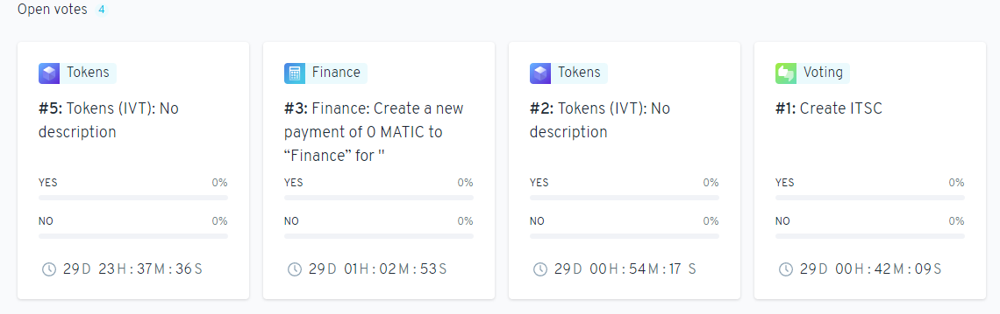

# DAO to DeSci杂志

本文以Aragon为基础创建了DAO

# Aragon DAO

https://client.aragon.org/#/jtiv/

在测试服务器`Mimbai`有我们创建的`jtiv`**DAO**

组织形式为**Reputation**

> Use non-transferable tokens to represent reputation. Decisions are made
> using reputation-weighted voting.

主要是为杂志创建的**DAO**，每个用户的权限是定向的，不允许用户之间转让**token**来改变权限

拥有的功能为——
1. Tokens 令牌
2. Voting 投票
3. Finance 财政

## Tokens

每一个**DAO**都需要一种**token**来决定**Voting**的权重

在创建时候就会给初创人员一定的**token**

现在`jtiv`的**token**名为`IVT`，总共发行了1101个

`holder`现在有`math`和`bio`两个用户，持币分别是`1100`和`1`

### Add tokens

可以给用户增加**token**也就是本**DAO**的`IVT`

比如给名为`bio`的`holder`增加500个`IVT`

消耗必要的**gas**后，可以创建这个**Tokens**的**Voting**

> **DAO**的一个重要内容区别于之前的中心化组织，就是给人增加**Tokens**也是需要民主的投票决定，而不是直接执行

也可以通过**address**给新的`holder`以`token`

### Remove token

同样的，也可以减少`holder`的`IVT`，同样是需要消耗**gas**创建**Voting**

## Voting

在**Tokens**不管`add`还是`remove`创建的内容，都会在**Voting**中列表显示

> token创建的投票，会有token的标志

### New vote

可以创建一个纯**Voting**并没有其他的交易改变，但是不管有没有附带内容，只要是合约，都会消耗**gas**

### Voting

从列表可以进入详情，执行`Yes`或者`No`的**Voting**操作

执行**Voting**也是一种合约，所以也需要消耗**gas**

投票会按照**token**的权重，最后算出是否通过

### 扩展

虽然**Voting**对于**Tokens**和**Finance**没有任何影响，

但是通过合约**address**，可以做各种扩展的绑定，比如用户投稿之后，就会自动创建一个**Voting**，

所有审稿人按照权重投稿完毕之后，

如果通过，就会触发杂志里的投稿通过的一系列操作；如果没有通过，也是触发拒稿操作。

总之，根据DAO的合约地址可以做各种想要的扩展

## Finance

可以显示**DAO**的财政

### Deposit

每一个`holder`都可以吧自己的货币放入**DAO**中

> 这里的`token`跟**DAO**自身的`tokens`是完全不一样的两个东西，这里指的是实际的钱，比如可以是**Ethereum**或者**Bitcoin**

### Withdrawal

每一个`Deposit`的货币，都可以`Withdrawal`(撤回)

需要找到之前`Deposit`的合约地址

可以全部撤回，也可以部分撤回

`deposit`是直接完成，但是`withdrawal`需要进入`Voting`，投票通过之后才能完成撤回货币的操作

类似**Voting**中的**Tokens**，**Finance**也有`Finace`的标志

## 总结

**DAO**，总得来说是一个公开透明的组织，所有的投票也都是公开透明

区块链技术在有限的智能合约下完成了各种投票

应用每一个合约地址，所有开发者可以在其基础上开发各种应用完成客观公正的决策

每一个`holder`都可以在**DAO**中做主人
